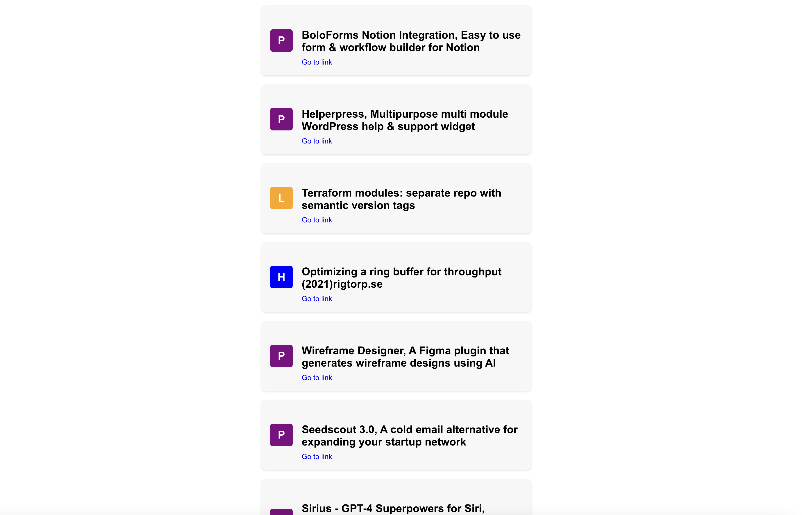

# DEVIO.actu

This is a small web application that retrieves and displays the latest news from the world of technology, specifically focusing on programming

## Table of Contents

- [Overview](#overview)
- [Image](#images)
- [Getting Started](#getting-started)
  - [Prerequisites](#prerequisites)
  - [Installation](#installation)
- [Usage](#usage)
- [Contributing](#contributing)
- [License](#license)

## Overview

Provide an overview of the project, including its purpose, features, and any relevant details. You can mention the technologies or frameworks used, the problem the project aims to solve, and any unique aspects that make it stand out.


## Image



This is a small web application that retrieves and displays the latest news from the world of technology, specifically focusing on programming.


## Getting Started

Follow these instructions to get the project up and running on your local machine for development and testing purposes.

### Prerequisites

List any prerequisites or dependencies that need to be installed on the user's machine. Include links to installation guides or official documentation, if applicable.

1. install make tool command

### Installation

1. Clone the repository:

   ```shell
   git clone https://github.com/your-username/your-repository.git
2. Enter in the repository
   ```shell
   cd coden.link
3. Install the dependencies
    ```shell
    make install
4. Run the project
    ```shell
    make build
5. Dont forget to change backend url in front end , actually i am using ngrok because of axios network error


6. Go to the localhost, default : 3000 for backend and 8080 for frontend
 

 ## Usage


 The project is a news aggregator that fetches and displays news articles from three different sources: Lobsters, Hacker News, and Product Hunt. It uses Express.js on the backend to handle API requests and Axios along with Cheerio for web scraping. The frontend is built with React, and it dynamically renders news cards with information such as title, link, and origin. The project aims to provide users with a randomized selection of news articles from various sources, allowing them to explore and discover interesting content.


 ## Contributing

Thank you for considering contributing to this project! Contributions are welcome and greatly appreciated. To contribute, please follow these steps:

1. Fork the repository and clone it to your local machine.
2. Create a new branch for your feature or bug fix: `git checkout -b feature/your-feature-name` or `git checkout -b bugfix/your-bugfix-name`.
3. Make your changes and ensure they are properly tested.
4. Commit your changes: `git commit -m "Your commit message"`.
5. Push to the branch: `git push origin feature/your-feature-name` or `git push origin bugfix/your-bugfix-name`.
6. Open a pull request in the main repository, explaining the purpose and details of your contribution.

Please ensure that your contributions adhere to the project's coding conventions and standards. Also, make sure to update relevant documentation, such as README.md, if necessary.

If you have any questions or need assistance, feel free to open an issue or contact the project maintainers.

Thank you for your support and happy contributing!
